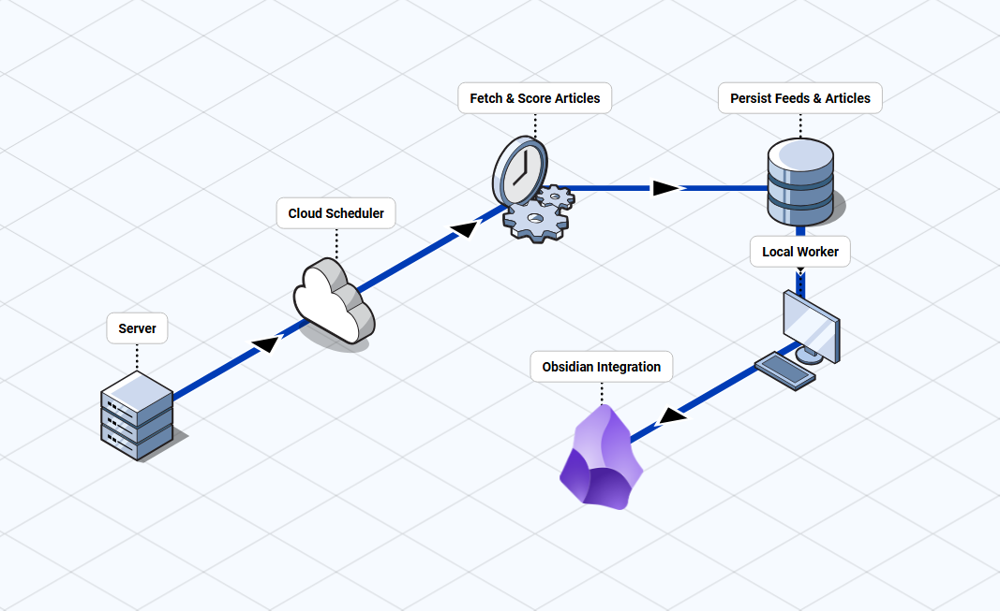

# Signal

Signal is a backend-first content intelligence pipeline for engineers.

It ingests RSS feeds, filters and scores articles with LLM-assisted signals, tracks feed quality, and exports curated content to Obsidian through a local sync worker.

## Why This Project Exists

Most feed readers optimize for volume, not learning outcomes.

Signal optimizes for:

- high-signal backend learning
- low-noise content curation
- repeatable personal publishing workflow

## Core Architecture

Signal runs with a cloud/local split:

- Cloud side:
  - scheduled RSS ingestion
  - dedupe and scoring
  - feed health and retention cleanup
  - PostgreSQL persistence
- Local side:
  - pulls pending curated articles
  - writes markdown into Obsidian vault
  - marks export status in DB



## Current Capabilities

- idempotent ingestion with URL normalization + hash memory
- structured AI scoring persisted in `article_scores`
- tag extraction persisted in `article_tags`
- feed quality classification (`healthy` / `degraded` / `disabled`)
- auto-disable feeds after repeated fetch failures
- retry endpoint for failed Obsidian exports
- scheduled cleanup of stale non-curated articles
- unit and integration-light test coverage

## Tech Stack

- FastAPI
- SQLAlchemy async + asyncpg
- Alembic
- APScheduler
- Groq API
- uv + pytest

## Quickstart (Local)

### 1) Install dependencies

Runtime:

```bash
uv pip install --python ".venv\Scripts\python.exe" -r requirements.txt
```

Dev/test:

```bash
uv pip install --python ".venv\Scripts\python.exe" -r requirements-dev.txt
uv pip install --python ".venv\Scripts\python.exe" -e .
```

### 2) Configure environment

Copy `.env.example` to `.env` and set values:

- `DATABASE_URL`
- `API_KEY`
- `GROQ_API_KEY`
- `OBSIDIAN_VAULT_PATH` (local machine only)

### 3) Run migrations

```bash
alembic upgrade head
```

### 4) Start API

```bash
uv run --python ".venv\Scripts\python.exe" uvicorn app.main:app --reload --port 8080
```

## Daily Operations

### Manual fetch

`POST /api/feeds/fetch`

### Manual cleanup

`POST /api/feeds/cleanup`

### Retry failed Obsidian exports

`POST /api/articles/obsidian/retry-failed?limit=50`

### Local Obsidian export

```bash
uv run --python ".venv\Scripts\python.exe" python -m app.scripts.sync_obsidian
```

### Feed quality view

`GET /api/feeds/quality`

Optional filters:

- `status=healthy|degraded|disabled`
- `min_scored_articles=<int>`
- `min_curated_rate=<0..1>`

## Important Endpoints

- `GET /api/articles` with filters/pagination/sorting
- `POST /api/articles/obsidian/retry-failed`
- `POST /api/feeds/fetch`
- `POST /api/feeds/cleanup`
- `GET /api/feeds`
- `GET /api/feeds/quality`
- `POST /api/feeds/{feed_id}/reactivate`
- `GET /api/jobs/runs`

## Tests

Run all tests:

```bash
uv run --python ".venv\Scripts\python.exe" pytest -q
```

Current suite includes:

- feed URL normalization/hash/rule tags
- feed health + auto-disable behavior
- scheduler job run behavior
- API route contract validation
- Obsidian writer and sync logic
- AI scoring parser/normalization

## Environment Variables

See `.env.example` for full list.

Notable operational knobs:

- `FETCH_INTERVAL_HOURS`
- `CLEANUP_INTERVAL_HOURS`
- `NON_CURATED_RETENTION_DAYS`
- `FEED_DISABLE_AFTER_FAILURES`
- `FEED_QUALITY_MIN_SCORED_ARTICLES`
- `FEED_QUALITY_MIN_CURATED_RATE`
- `HTTP_USER_AGENT`

## Notes

- Cloud runtime cannot write directly to local Obsidian paths.
- Use local `sync_obsidian` worker for markdown export.